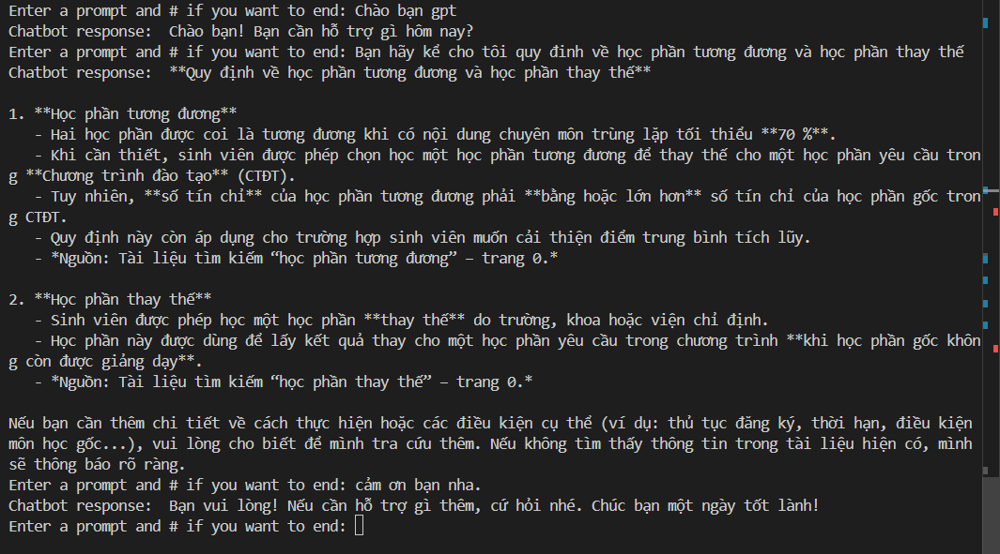

# 🔎 RagSystem

<p align="left">
  
  
  
  
  <a href="https://fastapi.tiangolo.com/">
    
  </a>
</p>

Retrieval-Augmented Generation (RAG) workflow from document processing to context retrieval and response generation. The model can decide to use tools when appropriate.

## Table of Contents
- [Overview](#overview)
- [Features](#features)
- [Architecture](#architecture)
- [Getting Started](#getting-started)
- [Usage](#usage)
- [Demo](#demo)
- [Configuration](#configuration)
- [Notes and Limitations](#notes-and-limitations)
- [Roadmap](#roadmap)
- [Contributing](#contributing)
- [License](#license)

## Overview
RagSystem provides an end-to-end pipeline:
1. Ingest and preprocess documents.
2. Split and embed text into vector representations.
3. Index embeddings for fast retrieval.
4. Retrieve relevant context at query time.
5. Use an LLM to generate grounded answers, with the option for the model to invoke tools when needed.

This setup helps reduce hallucinations and improves answer quality by grounding responses in your own data.

## Features
- Document ingestion and preprocessing (PDF, text, and other common formats)
- Chunking and embedding for scalable retrieval
- Pluggable vector index/backends
- Context-aware generation (RAG loop)
- Tool-use decision making by the model when appropriate
- Simple configuration via environment variables
- Create local API for transfering data with other Applications.

## Architecture
High-level flow:
- Data ingestion: Load documents and normalize text
- Chunking: Split content into manageable segments
- Embedding: Convert chunks to vectors using an embedding model
- Indexing: Store vectors in a vector database or in-memory index
- Retrieval: Fetch top-k relevant chunks per query
- Generation: Compose a prompt with retrieved context for the LLM
- Tool-use: Allow the model to decide whether to call tools (e.g., search, calculators, APIs) to improve answers

## Getting Started

### Prerequisites
- Python 3.10+ recommended
- Optionally, API keys for your chosen LLM or embedding providers

### Installation
`requirements.txt`, install dependencies with:
```bash
python -m venv .venv
source .venv/bin/activate   # On Windows: .venv\Scripts\activate
pip install -r requirements.txt
```

## Usage

Minimal example illustrating a typical RAG loop (adapt to your code):

```python
# 1) Load and split documents
docs = load_documents("path/to/your/docs")          # implement or use a loader
chunks = split_documents(docs, chunk_size=800, overlap=100)

# 2) Embed and index
embeddings = embed_chunks(chunks)                   # e.g., with a chosen embedding model
index = build_index(embeddings, metadata=chunks)    # e.g., FAISS/Chroma/other

# 3) Ask questions
query = "What does the policy say about data retention?"
retrieved = index.search(query, top_k=5)

# 4) Let the model decide to use tools or not
answer = llm_generate(
    query=query,
    context=retrieved,
    tools=[/* optional tools you expose to the model */],
    allow_tool_use=True
)

print(answer)
```

Tips:
- Keep chunks small enough for accurate retrieval but large enough to preserve context.
- Use consistent text normalization to improve recall.
- Track metadata (source path, page number) alongside chunks for citations.

## Demo

Here is a conversation demo from the project:


## Configuration

Set environment variables (create a `.env` if you prefer):
- OPENAI_API_KEY or ANTHROPIC_API_KEY (or other LLM provider keys)
- EMBEDDING_MODEL, LLM_MODEL (if configurable)
- VECTOR_STORE (e.g., faiss, chroma), VECTOR_STORE_PATH (if applicable)
- Any additional tool-related keys (e.g., SEARCH_API_KEY)

Example `.env`:
```
OPENAI_API_KEY=your_key_here
EMBEDDING_MODEL=text-embedding-3-large
LLM_MODEL=gpt-4o
VECTOR_STORE=faiss
```

## Notes and Limitations
- RAG quality depends heavily on document quality, chunking strategy, and embedding model choice.
- Grounding reduces but does not eliminate hallucinations; always validate answers for critical domains.
- Tool-use can improve answers but may introduce latency and complexity—enable it only when it adds value.

## Roadmap
- Add evaluation scripts for retrieval and answer quality
- Add citation highlighting in generated answers
- Add optional reranking models for improved retrieval
- Provide reference implementations for multiple vector stores
- Add streaming and function-calling examples

## Contributing
Contributions are welcome! Please:
- Open an issue to discuss proposed changes
- Submit focused pull requests with clear descriptions

## License
Apache-2.0
